# Burger Blast

Welcome to Burger Blast, where flavor meets delight! We're a culinary haven dedicated to crafting unforgettable experiences through sensational bites and impeccable service. This is a theoretical burger restaurant based in London, UK.

The site allows users:

- To view information about the location
- View our up to date Menu
- Contact us through a form sumbition
- Sign up for an account
- Login or out of the account
- Change account details and password
- While logged in the user has the ability to create reservations up to 2 weeks in advance starting from the next day counting 14 days.
- They can then edit these reservations as needed
- Users and staff can edit or delete reservations
- Admin users or Staff can access the admin page and login
- From here they have direct control to modify Menu, Users, Reservations, and more.

---

## User Stories

** Sprint One**

- The Basics

| **User Stories**                                                                                                     | **Needed for MVP** | Completed |
| -------------------------------------------------------------------------------------------------------------------- | :----------------: | :-------: |
| As a user, I can view basic information about Burger Blast, such as location and contact details.                    |        Yes         |    Yes    |
| As a user, I can access the Burger Blast website seamlessly on various devices, ensuring a user-friendly experience. |        Yes         |    Yes    |

** Sprint Two**

- Menu and authentication system.

| **User Stories**                                                                                                                                                                        | **Needed for MVP** | Completed |
| --------------------------------------------------------------------------------------------------------------------------------------------------------------------------------------- | :----------------: | :-------: |
| As a user, I desire the capability to register for an account and receive a confirmation email, enabling me login and out.                                                              |        Yes         |    Yes    |
| As a user, I aim to effortlessly log in and out of my account, ensuring secure access to my reservation history and personal information.                                               |        Yes         |    Yes    |
| As a customer, I desire a menu with comprehensive descriptions to facilitate informed decisions about the dishes offered, helping me assess their appeal before making a dining choice. |        Yes         |    Yes    |

**Sprint Three**

- The admin site, socials and email integrations.

| **User Stories**                                                                                                                                                 | **Needed for MVP** | Completed |
| ---------------------------------------------------------------------------------------------------------------------------------------------------------------- | :----------------: | :-------: |
| As a user, I can share Burger Blast on social media and follow updates, enhancing my engagement with the restaurant.                                             |        Yes         |    Yes    |
| As a user, I receive timely notifications about reservation confirmation, changes, cancelations or changes to user details and password, ensuring I stay informe |        Yes         |    Yes    |
| As a staff member, I can edit account information, delete user accounts, manage reservations, and update menu items using an admin dashboard.                    |        Yes         |    Yes    |
| As a customer, I can modify or cancel my reservation, giving me flexibility in managing my dining plans.                                                         |        Yes         |    Yes    |
| As a customer, I can make a reservation for a specific date and time, ensuring a table is available when I arrive.                                               |        Yes         |    Yes    |

**Sprint Four**

- The extra tidbits aka nice to haves.

| **User Stories**                                                                                                                                   | **Needed for MVP** | Completed |
| -------------------------------------------------------------------------------------------------------------------------------------------------- | :----------------: | :-------: |
| As a customer, I can place orders online for pickup or delivery, providing a convenient way to enjoy Burger Blast's menu.                          |         No         |    No     |
| As a customer, I want the ability to delete my user account with a secure verification process, providing me control over my personal information. |         No         |    No     |
| As a user, I want a secure process to recover my password in case I forget it, ensuring I can regain access to my account.                         |         No         |    No     |
| As a user, I want to be able to fill out a contact form to message the restaurant, Providing me another form of contact if needed                  |         No         |    Yes    |
| As staff, I want to be able to receive the contact forms in store email, So that I can respond in a timely manner to any inquiries                 |         No         |    Yes    |

(MVP = Minimal Viable Product)

## Features

### Navbar

- The Burger Blast logo is a visual emblem that encapsulates the essence and character of our restaurant. It serves as a succinct representation of our brand identity, reflecting our commitment to delivering delicious burgers in a vibrant and welcoming atmosphere.

### Logo

- Visually sets the standard for the brands perception generally the first thing seen by customers and the lasting image

- Original logo below:

### Index

- The index page for Burger Blast provides users with essential information about the restaurant, such as its name, slogan, and opening hours. It welcomes visitors to the restaurant, highlighting its commitment to delivering delightful flavors and memorable experiences through its food and service. Users can quickly find the restaurant's operating hours, ensuring they know when they can visit. Additionally, the page encourages users to embark on a flavorful journey with Burger Blast, promising a satisfying dining experience that will leave them happy. Overall, the index page serves as a welcoming introduction to Burger Blast, enticing users to explore further and consider visiting the restaurant for a tasty adventure.

---

### About US

- It provides users with an engaging overview of the restaurant's ethos, cuisine, and dining experience. Through vibrant language and enticing imagery, it aims to create an immersive experience for the user, inviting them to explore the restaurant's offerings and join its culinary journey. The page is structured into sections, each highlighting different aspects such as the restaurant's philosophy, menu offerings, commitment to quality, culinary expertise, customer service, community engagement, and the overall dining adventure awaiting the visitors. It serves to inform and entice potential customers, giving them a glimpse into what makes Burger Blast unique and why they should consider dining there.

---

### Signup

- Allows Users to signup for an account using providing username, first name, last name, email, and password with a validation method provided by django.

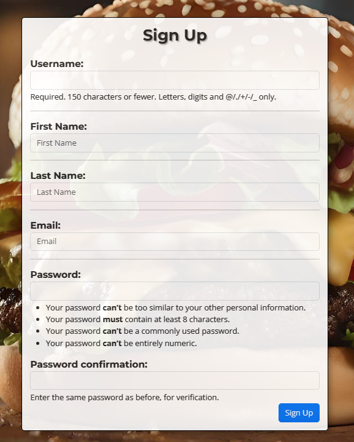

**Signup Email**

---

### Sign In

- Allows Users to sign into their accounts using username and password.

---

### Change Details

- Alows users to change their account details or password.

**Change Details Email**

**Change Password Email**

---

### My Reservations

- The "My Reservations" page is where users can view all their bookings in one place. It displays essential details like confirmation number, reservation date and time, party size, and any special requests made during the booking process. Users can also perform actions such as deleting or editing their reservations. If there are no reservations found, a message indicating so will be shown. Additionally, users have the option to make a new reservation directly from this page. Overall, it's a convenient hub for managing and keeping track of reservations. Staff can view and edit all reservations as well sa see slightly more information like name and user.

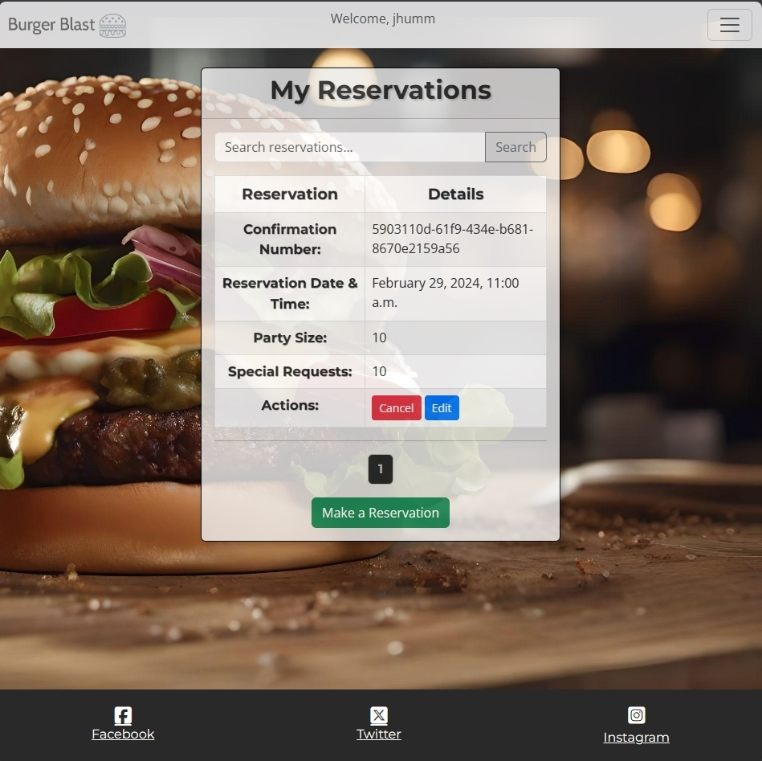

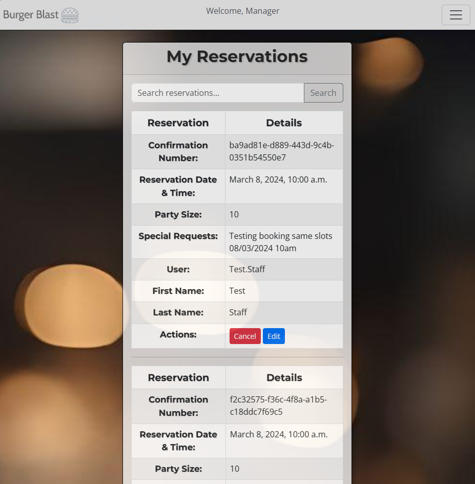

---

### Make Reservations

- The "Make Reservations" page is where you can easily reserve a spot or book a service. It's designed to be user-friendly, with a simple form for you to fill out. You'll find fields asking for necessary information, such as your name, contact details, and the specifics of what you're booking. Once you've filled out the form, just hit the "Submit Reservation" button, and your reservation will be confirmed. It's a convenient way to secure your spot without any hassle.

**Make Reservation Email**

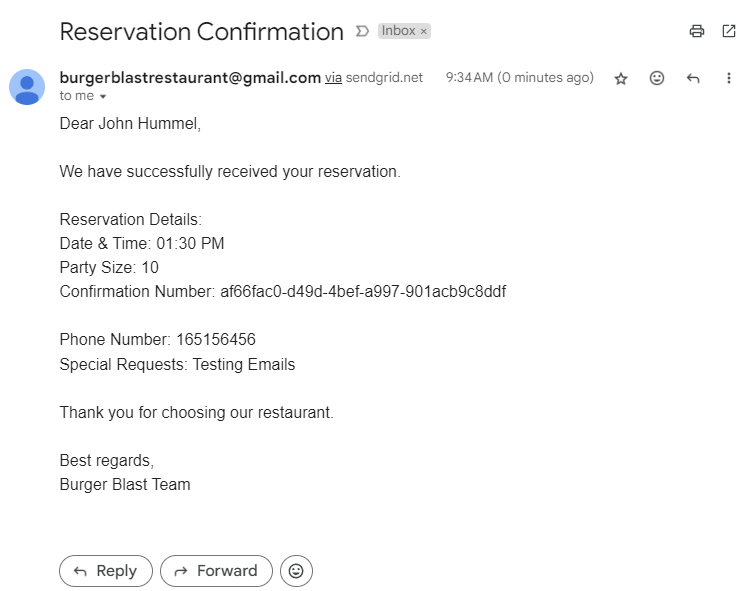

---

### Edit Reservations

- The "Edit Reservations" page allows you to make changes to your existing reservations. If you need to update your booking details, such as the date, time, or any other specifics, you can do so easily on this page. It's designed to be user-friendly, similar to the reservation form, with a straightforward interface for you to modify your information. Once you've made the necessary edits, simply save your changes, and your reservation will be updated accordingly. It's a convenient way to ensure that your booking reflects any adjustments you need to make.

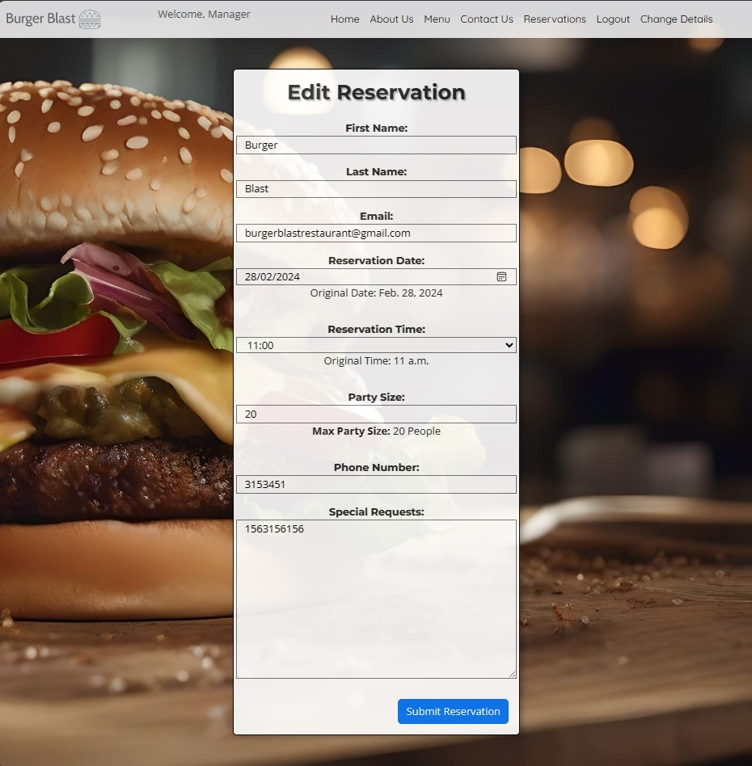

**Edit Reservation Email**

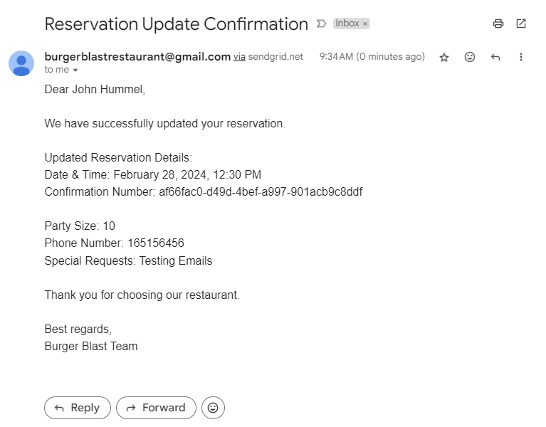

**Staff Cancel Reservation Email**

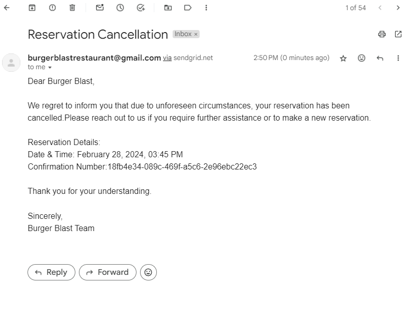

**User Cancel Reservation Email**

---

### Menu

- The menu page is a part of a website where you can explore the different food options available. It's designed to make it easy for you to find what you're looking for by organizing the menu into categories like sides, entrees, and desserts. Each category has its own section that you can navigate to by clicking on buttons. When you click on a category, it shows you all the items available in that category. Each item is displayed with a name, a description, price, calories, allergens, and preparation time. This layout helps you quickly browse through the menu and decide what you want to order based on your preferences.

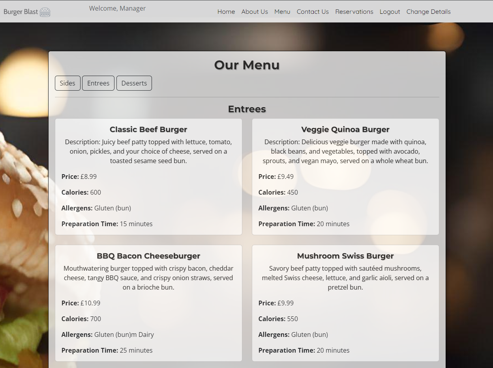

---

### Contact us

- This page allows a user to fill out a form that will then be emailed to the restaurant.

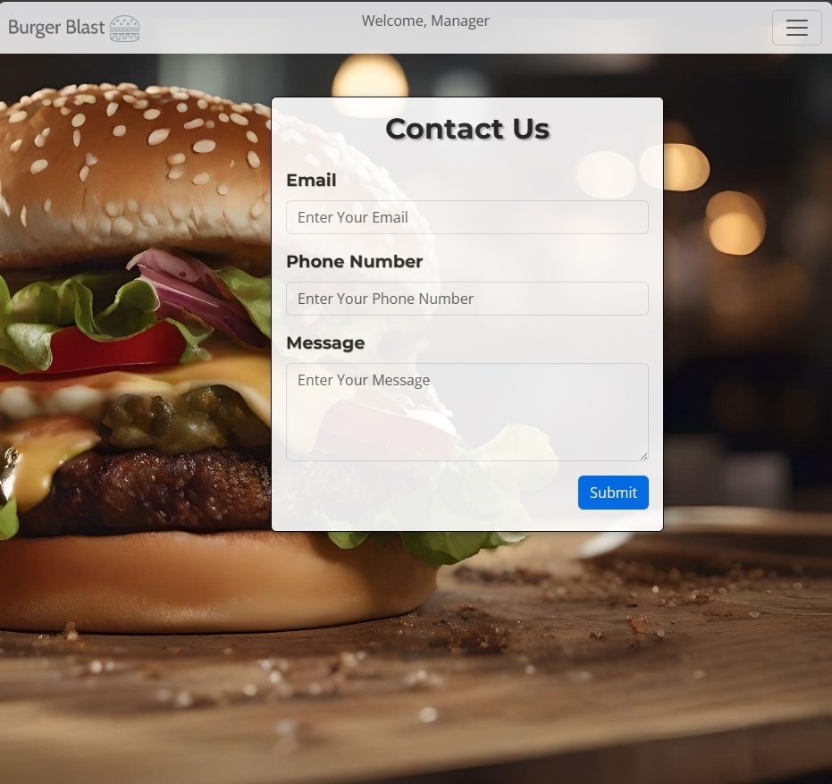

---

### footer

- Links to Social Sites

---

### Error Pages

**400**

**403**

**404**

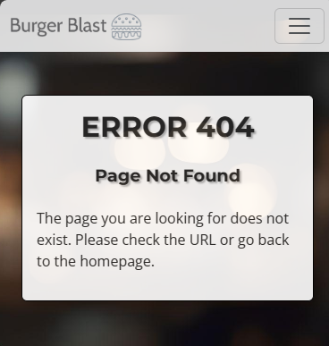

**500**

### Django Admin

- Django admin is a powerful tool designed to make managing a website easier for staff members. It provides a user-friendly interface where staff can easily add, edit, or delete content without needing technical skills. Staff members can log in and access a dashboard that gives them control over various aspects of the website, such as managing user accounts, updating product listings, posting articles, and more. The admin panel organizes information neatly, allowing staff to navigate through different sections effortlessly. It's like having a control center for the website, making it simple for staff members to keep everything running smoothly and up-to-date.

---

## Testing

|                                                         What test was completed                                                         | Passed? Y(yes)/N(no) |           Other information           |
| :-------------------------------------------------------------------------------------------------------------------------------------: | :------------------: | :-----------------------------------: |
|                                                       Make a super user (Manager)                                                       |          Y           |                                       |
|                                                         Make a staff member ()                                                          |          N           |                                       |
|                                        Sign up as a customer/user (Jane.Doe, John.Doe, Jon.Doe)                                         |          Y           |                                       |
|                                                      Login to site as a superuser                                                       |          Y           |                                       |
|                                                        Login to site as a staff                                                         |          N           |                                       |
|                                                    Login to site as a customer/user                                                     |          Y           |                                       |
|                                                     Log out of site as a superuser                                                      |          Y           |                                       |
|                                                       Log out of site as a staff                                                        |          N           |                                       |
|                                                   Log out of site as a customer/user                                                    |          Y           |                                       |
|                                                 Login to Django admin as customer/user                                                  |          Y           |  Only staff can log in successfully   |
|                                                   Login to Django admin as superuser                                                    |          Y           |  Only staff can log in successfully   |
|                                                     Login to Django admin as staff                                                      |          Y           |  Only staff can log in successfully   |
|                                                  Log out of Django admin as superuser                                                   |          Y           |                                       |
|                                                    Log out of Django admin as staff                                                     |          Y           |                                       |
|                                             Successfully change any users data on main site                                             |          Y           |                                       |
|                                            Successfully change any users data on admin site                                             |          Y           |  Can only be done as a satff member   |
|                                                   Make reservation as a customer/user                                                   |          Y           |                                       |
|                                                     Make reservation as a superuser                                                     |          Y           |                                       |
|                                                        Make reservation as staff                                                        |          Y           |                                       |
|                                                   Edit reservation as a customer/user                                                   |          Y           |                                       |
|                                                     Edit reservation as a superuser                                                     |          Y           |                                       |
|                                                        Edit reservation as staff                                                        |          Y           |                                       |
|                                                  Delete reservation as a customer/user                                                  |          Y           |                                       |
|                                                    Delete reservation as a superuser                                                    |          Y           |                                       |
|                                                       Delete reservation as staff                                                       |          Y           |                                       |
|                                              Edit reservation as a superuser on admin site                                              |          Y           |                                       |
|                                                 Edit reservation as staff on admin site                                                 |          Y           |                                       |
|                                             Delete reservation as a superuser on admin site                                             |          Y           |                                       |
|                                                Delete reservation as staff on admin site                                                |          Y           |                                       |
| Check vanila validation setting to see if a typical user can make a reservation out side of normal constraints with out nefarious means |          Y           | Unable to book outside of constraints |
|                                                                                                                                         |                      |                                       |

### Bugs/Issues Encountered

|                                                 Bugs/Issues Encountered                                                 |                                                                                                How problem was fixed                                                                                                | Fixed Y(yes)/N(no) |
| :---------------------------------------------------------------------------------------------------------------------: | :-----------------------------------------------------------------------------------------------------------------------------------------------------------------------------------------------------------------: | :----------------: |
| Allowing customers/users to sign up for an account with an email verification system as emails wern't sending correctly |                                                                                  Removed the verification prior to making it live                                                                                   |         Y          |
|                                       Getting images to load into the menu items                                        |                                                                                Removed due to time constraint may add back in future                                                                                |         Y          |
|                                        Getting static files to work as intended                                         |                                                  A few varriations of code to find one that worked best for my needs had 2 locations stores brought it down to one                                                  |         Y          |
|                                    Getting static file js to load for menu selection                                    |                                                                                added it in script tags instead as its a small script                                                                                |         Y          |
|                      Users could set any date or time in making reservation whether future or past                      | Added js and python with validation checks in place ti ensure users can only book during opening hours and up to two hours prior to close with up to two weeks in advance possible. Same day is not possible online |         Y          |

---

## Validation Testing

### Python

All Scripts checked with [PEP8 Code institute](https://pep8ci.herokuapp.com/)

|                   **File**                    | **Line** | **Errors or Warnings** |
| :-------------------------------------------: | :------: | :--------------------: |
|                 about\apps.py                 |   All    |          None          |
|                about\forms.py                 |   All    |          None          |
|                 about\urls.py                 |   All    |          None          |
|                about\views.py                 |   All    |          None          |
|            authentication\apps.py             |   All    |          None          |
|            authentication\forms.py            |   All    |          None          |
| authentication\tests_authentication_basics.py |   All    |          None          |
|            authentication\urls.py             |   All    |          None          |
|            authentication\views.py            |   All    |          None          |
|             burger_blast\asgi.py              |   All    |          None          |
|           burger_blast\settings.py            |   All    |          None          |
|             burger_blast\urls.py              |   All    |          None          |
|             burger_blast\wsgi.py              |   All    |          None          |
|                 email_test.py                 |   All    |          None          |
|                   manage.py                   |   All    |          None          |
|                meals\admin.py                 |   All    |          None          |
|                 meals\apps.py                 |   All    |          None          |
|                meals\models.py                |   All    |          None          |
|            meals\test_menu_add.py             |   All    |          None          |
|           meals\test_menu_remove.py           |   All    |          None          |
|                 meals\urls.py                 |   All    |          None          |
|                meals\views.py                 |   All    |          None          |
|             reservation\admin.py              |   All    |          None          |
|              reservation\apps.py              |   All    |          None          |
|             reservation\forms.py              |   All    |          None          |
|             reservation\models.py             |   All    |          None          |
|              reservation\urls.py              |   All    |          None          |
|             reservation\views.py              |   All    |          None          |

### CSS

-checked with [W3 CSS Validator](https://jigsaw.w3.org/css-validator/) completed with no issues found.

### HTML

- checked with [W3 HTML Validator](https://validator.w3.org/) on all pages with no errors or warnings.

### Contrast

- Checked all non logged in pages with [A11Y contrast checker](https://color.a11y.com/) Cameback with no issues.

**Index**

**About Us**

**Menu**

**Contact Us**

**Login**

**Sign Up**

### Index

**Chrome lighthouse desktop**

**Chrome mobile lighthouse**

### About

**Chrome lighthouse desktop**

**Chrome mobile lighthouse**

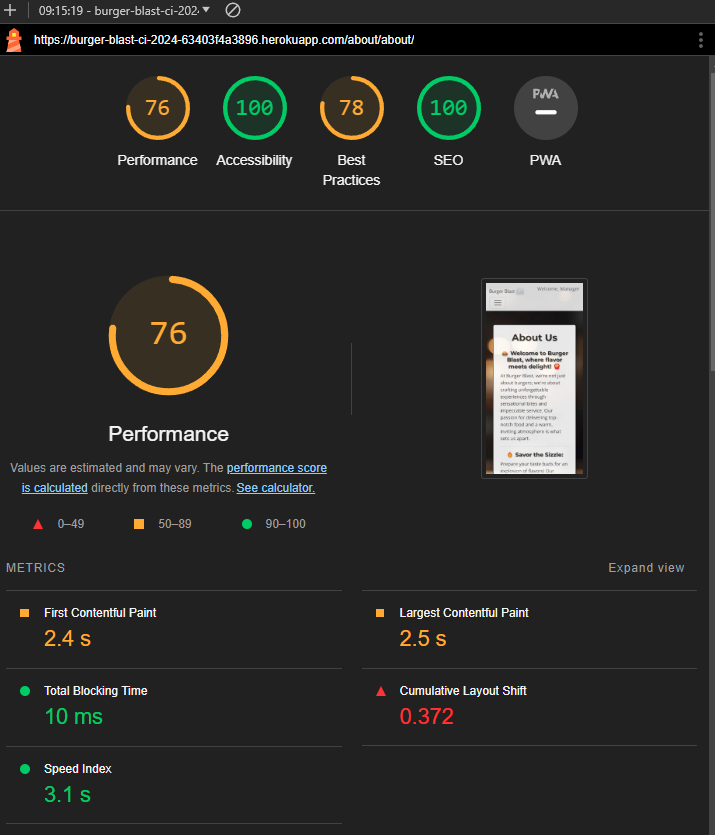

### Admin

**Admin Login Chrome lighthouse desktop**

**Admin Login Chrome mobile lighthouse**

**Admin Pannel Chrome lighthouse desktop**

**Admin Pannel Chrome mobile lighthouse**

### Reservations

**Edit Reservation Chrome lighthouse desktop**

**Edit Reservation Chrome mobile lighthouse**

**Make Reservation Chrome lighthouse desktop**

**Make Reservation Chrome mobile lighthouse**

**My Reservation Chrome lighthouse desktop**

**My Reservation Chrome mobile lighthouse**

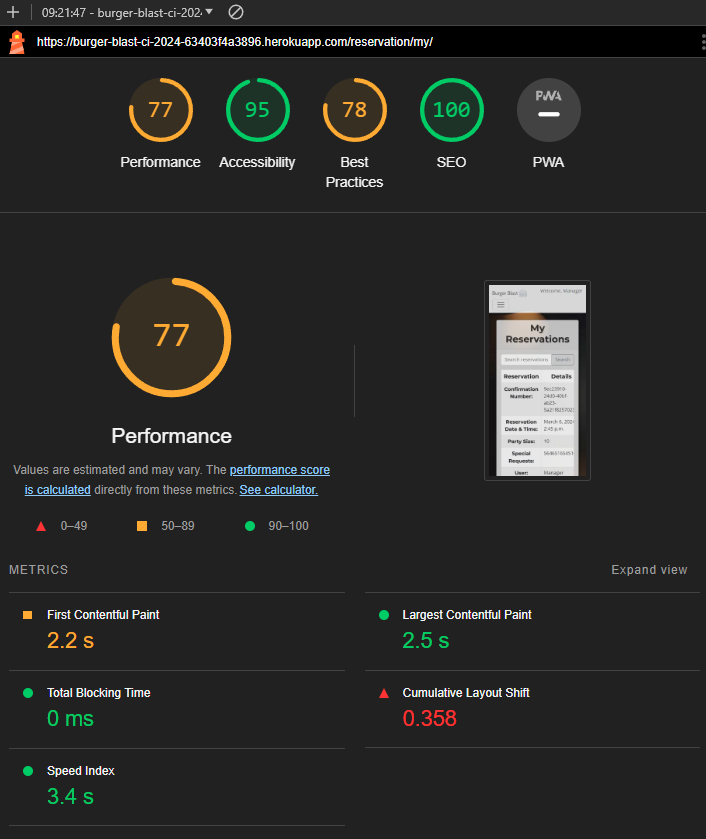

### Menu

**Chrome lighthouse desktop**

**Chrome mobile lighthouse**

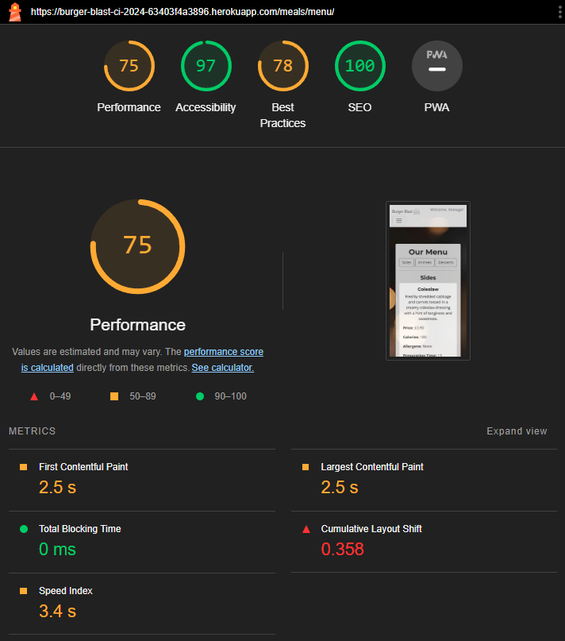

### Signup

**Chrome lighthouse desktop**

**Chrome mobile lighthouse**

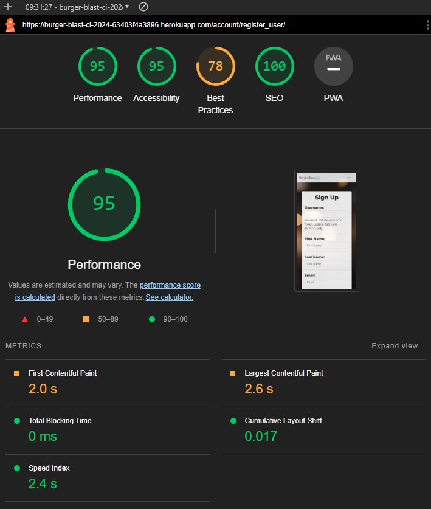

### Sign In

**Chrome lighthouse desktop**

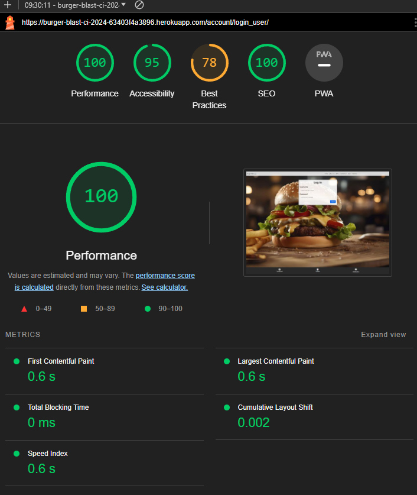

**Chrome mobile lighthouse**

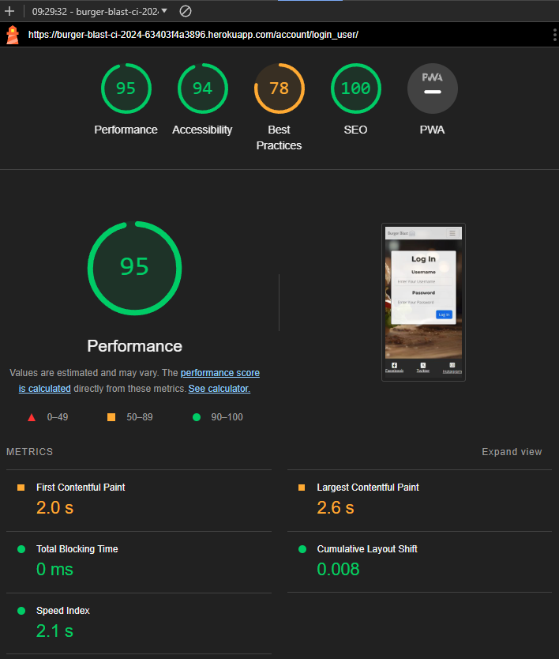

### Change Details

**Chrome lighthouse desktop**

**Chrome mobile lighthouse**

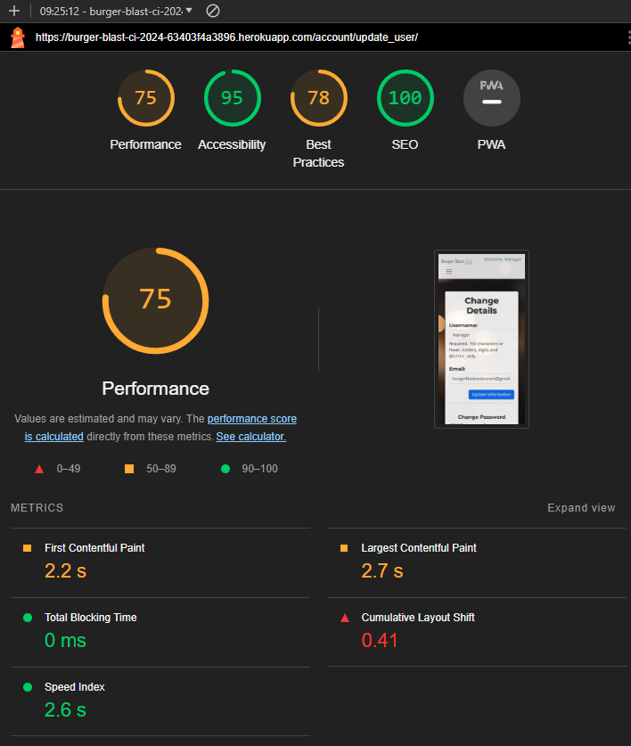

---

### Database

**Seting Up Database**

1. Go to [elephantsql](https://customer.elephantsql.com/login)
2. Make an account or sign in (I used my GitHub account)
3. Once logged in hit the "+ Create New Instance"

4. Set up a name for the plan.
5. Select version for the plan.
6. **Optional** Add any tags if you wish
7. Hit "select region" button

8. Select a Data Center.
9. Once chosen hit the "Review" button

10. If all looks correct hit "Create Instance"

11. Now you have your database set up all that is left is linking it to django project.
12. URL has a copy button hit this to copy your URL

12. Now you need to put this in your env file for the project or in your heroku config variables

**Heroku Cofig Variables**
| Key | Value |
|:---:|:-----:|
| DATABASE_URL | postgres database url |

- In the .env put it as "DATABASE_URL=your.database.url.HERE"

13. Now its linked to your project make sure to run the command to migrate all the models into your database as it is currently empty.

- Make migrations if you made any recent changes to the database models.

python manage.py makemigrations

- Migrate to move all the changes into your database.

python manage.py migrate

- There are more and other varriatons with diffrent useses [Click here to learn more (Django 5.0)](https://docs.djangoproject.com/en/5.0/topics/migrations/)

14. Now that migration is completed you are all set.
15. If you recieved an error please sort this out and then try again.

**Visualization of Databae**

- I was able to make this using [django-extensions](https://pypi.org/project/django-extensions/) and [graphviz](https://django-extensions.readthedocs.io/en/latest/graph_models.html)

**Broken apart visuals**

---

## Deployment

Used Heroku to deploy the website. You can [Visit Live Site by clicking here](https://burger-blast-ci-2024-63403f4a3896.herokuapp.com/)

### How to deploy to heroku:

1. **Run Migrations:** Once your project is deployed, you'll need to run any pending database migrations. You can do this using Heroku's web-based console or by running commands in your local terminal.
2. **Create a Superuser:** If your project uses Django's admin interface, you may want to create a superuser account on Heroku. You can do this by accessing your app's shell through the Heroku dashboard and running the createsuperuser command.
3. **Create a Heroku Account:** If you haven't already, sign up for a Heroku account at heroku.com.
4. **Prepare Your Django Project:** Ensure your Django project is properly configured for deployment. This includes setting up a requirements.txt file listing all dependencies and a Procfile specifying the command to start your application.
5. **Install Gunicorn:** Gunicorn is a WSGI HTTP server for Python. You'll need to install it via pip: "pip install gunicorn"
6. **Create a Procfile:** In the root directory of your project, create a file named Procfile (without any file extension) and add the following line: web: "web: gunicorn burger_blast.wsgi:application"
7. **Update Django Settings:** Ensure your Django settings.py file is configured to work in a production environment. This includes setting DEBUG = False and adding Heroku's domain to the ALLOWED_HOSTS list.
8. **Create a requirements.txt File:** Generate a requirements.txt file listing all Python dependencies your project needs. You can create it by running: "pip freeze > requirements.txt"
9. **Create a Heroku App:** Go to the Heroku dashboard and create a new app. Choose a unique name for your app.
10. **Link GitHub Repo:** Under deploy tab in the settings link your GitHub repository.
11. **Set Up Environment Variables:** Now under settings tab set any necessary environment variables for this django project. See chart below for needed key and values.

**Heroku Cofig Variables**
| Key | Value |
|:---:|:-----:|
| DISABLE_COLLECTSTATIC | 1 |
| DATABASE_URL | postgres database url |
| DJANGO_SECRET_KEY | Django secret key for the project |
| SENDGRID_API_KEY | sendgrid api key |
| CLOUDINARY_API_KEY | Api key value |
| CLOUDINARY_API_SECRET | Api secret value |
| CLOUDINARY_CLOUD_NAME | Cloudinary Name |

12. **Deploy Your Project:** Back under deploy tab on Heroku scroll down to manual deploy and choose the branch you wish to deploy and hit button "Deploy Branch" wait for the success and trouble shoot if needed.

## Technology used

- HTML
- CSS
- Fontawesome
- Google Fonts
- Visual Studios Code (VSCode)
- Github
- Git
- Gyzo
- mspaint
- Github Desktop App
- Cloudinary
- Python
- Django
- Django-extensions
- fotor (AI Image generator)
- Logo designed by [app logo site](https://app.logo.com/login)

## Wireframes

### Admin Page

- Ended up going with a pre built one from  "pip install django-admin-interface"

### Landing Page

### Menu

### Make/Edit Reservations

## Credits

**Images**

- Website Background Image by [fotor:](https://www.fotor.com/)

- Logo designed by [app logo](https://app.logo.com/)

**More Credits**

- My wife who’s been supper supportive of this change in career for me and just being out right amazing we will get her into this one way or another I am sure.

- Code Institute for providing an excellent accelerated learning platform worth every penny.

---

## Future feature ideas

|       Feature Ideas        | Why Not Implimented |
| :------------------------: | :-----------------: |
|        Reviews page        |    Nice to have     |
|     Email verification     |    Nice to have     |
|   Users Delete accounts    |    Nice to have     |
|   Reset/Forgot Password    |    Nice to have     |
| Online Ordering/Deliveries |    Nice to have     |
